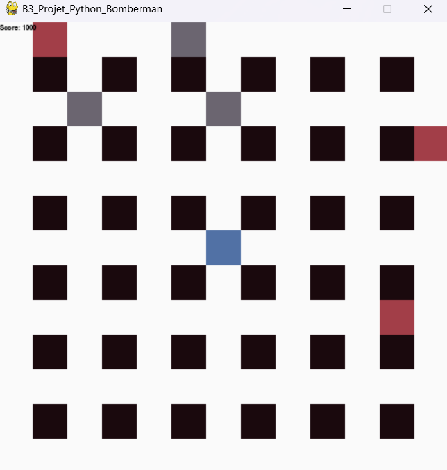

# 💣 Projet Bomberman

Ce projet est un jeu interactif inspiré de Bomberman où les joueurs naviguent dans un labyrinthe, posent des bombes stratégiquement pour détruire des obstacles, et éliminent des ennemis.

Projet réalisé par [Florent BACCARD](https://github.com/florentbaccard) & [Christopher PEREZ](https://github.com/Chr1stopherPerez), dans le cadre de notre formation à [EPSI](https://www.epsi.fr/).

## Introduction

L'objectif était d'acquérir des compétences en manipulation des variables, gestion du flux d'exécution du programme (comme les conditions et les boucles), traitement des entrées utilisateur (comme les mouvements du joueur ou la pose de bombes), et implémentation d'éléments de gameplay.

## Fonctionnalités Principales

**Plateau de Jeu :**

Une grille rectangulaire (matrice 2D) représentant le terrain, avec des cases pouvant être vides, des briques incassables ou cassables, ou des positions occupées par le joueur et les ennemis.

**Déplacement des Entités :**

Le joueur et les ennemis se déplacent horizontalement ou verticalement.
Les ennemis sont éliminés si une bombe explose à proximité.

**Gestion des Bombes :**

Le joueur peut poser des bombes qui explosent après un délai, détruisant les obstacles cassables et les ennemis dans un rayon d'une case.

**Conditions de Victoire ou de défaite :**

- Victoire : La partie est remportée lorsque tous les ennemis sont éliminés par les bombes du joueur.

- Défaite : Le joueur est touché par un ennemi ou se trouve dans la zone d'explosion de sa propre bombe.
  Le temps alloué s'épuise, et le joueur n'a pas réussi à éliminer tous les ennemis.

## Modèle de Données

- **Labyrinthe** : Matrice 2D gérant les différents types de cases.
- **Joueur** : Déplacement, position, score diminuant avec le temps.
- **Bombes** : Délai d'explosion, position, et rayon d'impact.
- **Ennemis** : Position aléatoire avec déplacement simple.
- **État du Jeu** : Gestion des cycles, vérification des collisions, et conditions de fin.

## Structure du Projet

**main.py :** Point d'entrée du jeu, initialise Pygame, configure la fenêtre, et orchestre les interactions principales du jeu, y compris le lancement des parties. <br>
**readme.md :** Documentation détaillant le projet, ses fonctionnalités, et comment le lancer.

**core :**

- `board.py` : Gestion du plateau de jeu, placement des briques, et affichage.

**entities :**

- `player.py` : Déplacement et actions du joueur.
- `bomb.py` : Pose et explosion des bombes.
- `enemies.py` : Déplacement des ennemis.

**utils :**

- `settings.py` : Paramètres de configuration, comme les couleurs et la taille des cases.

**docs :** Contient le PDF avec les exigences du projet.

## Technologies Utilisées


## Choix Techniques

- **Pygame :** Bibliothèque utilisée pour la gestion des graphismes et des entrées utilisateur.

- **Gestion des Collisions :** Suivi des positions dans une matrice pour détecter les interactions entre les entités.

- **Minuteur des Bombes :** Implémenté avec précision pour gérer les explosions de manière synchronisée.

## Étapes du Développement

- Création du Plateau : Mise en place d'une grille fixe pour tester les déplacements des entités.
- Développement du Joueur : Déplacement, gestion des collisions, et pose de bombes.
- Implémentation des Bombes : Délai d'explosion, rayon de destruction, et interaction avec l'environnement.
- Ajout des Ennemis : Déplacement aléatoire avec conditions de défaite si collision avec le joueur.
- Tests et Corrections : Débogage des fonctionnalités pour assurer un gameplay fluide.

## Difficultés Rencontrées

- Gestion des Collisions : Complexité de vérifier les interactions entre les entités sur un plateau dynamique.
- Synchronisation des Bombes : Assurer que les bombes explosent précisément après le délai défini.

## Améliorations Possibles

- Intelligence Artificielle Améliorée pour les Ennemis : Développer un comportement plus sophistiqué, par exemple, les ennemis pourraient détecter le joueur et le poursuivre
- Équilibrage de la Difficulté : Introduire des mécanismes pour ajuster la difficulté au fur et à mesure que le joueur progresse, comme des ennemis plus rapides ou un labyrinthe plus complexe.
- Animation et Effets Visuels : Ajouter des animations pour les déplacements, les explosions, et des effets visuels pour rendre le jeu plus attrayant.

## Captures d'Écran



## Instructions pour Lancer le Projet

**Installer les Dépendances** :

```bash
pip install pygame
```

**Exécuter le Jeu** :

```bash
python main.py
```
